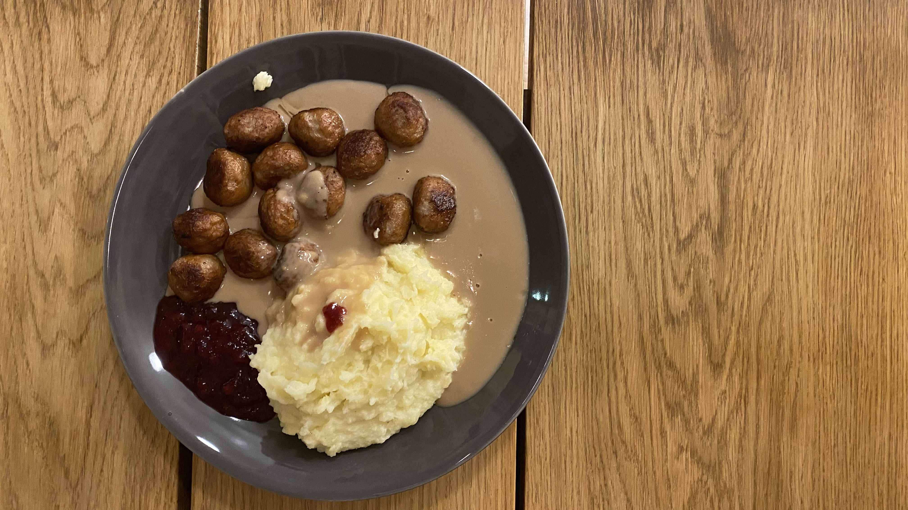

# Potatismos & köttbullar

Created: September 26, 2023 5:32 PM
Taggar: Lunch, Middag
Minuter: 30
Mängd: 4 portioner

# Bilder

---

# Ingredienser

- Potatismos
    - 1 kg potatis
    - 2.5 dl mjölk
    - 50 gram smör
    - Salt & vitpeppar
- Köttbullar
- Gräddsås
    - 2 påsar gräddsåspulver
    - 4 dl mjölk
    - 2 dl vatten
- Lingonsylt

---

# Tillagning

1. Skala & tärna 1 kg potatis. Häll i kastrull & täck med vatten. Låt koka tills mjuka.
2. Stek 20-25 köttbullar i en stekpanna.
3. Blanda 2 påsar gräddsåspulver med 2 dl vatten & 4 dl mjölk. Koka upp & låt sen sjuda tills den tjocknar till under omrörning.
4. Häll ut vattnet ur kastrullen med potatis, tillsätt 50 gram smör, salt & vitpeppar. Mosa allt i kastrullen, tillsätt sen 2.5 dl mjölk & mosa vidare till rätt konsistens. Lägg till mer mjölk/smör om det blir för tjockt.
5. Servera potatismos, köttbullar & gräddsås med lingonsylt.
